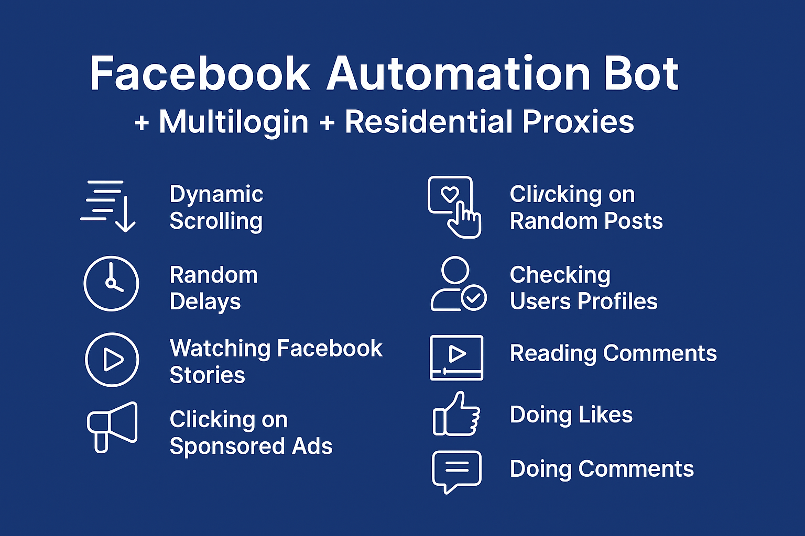
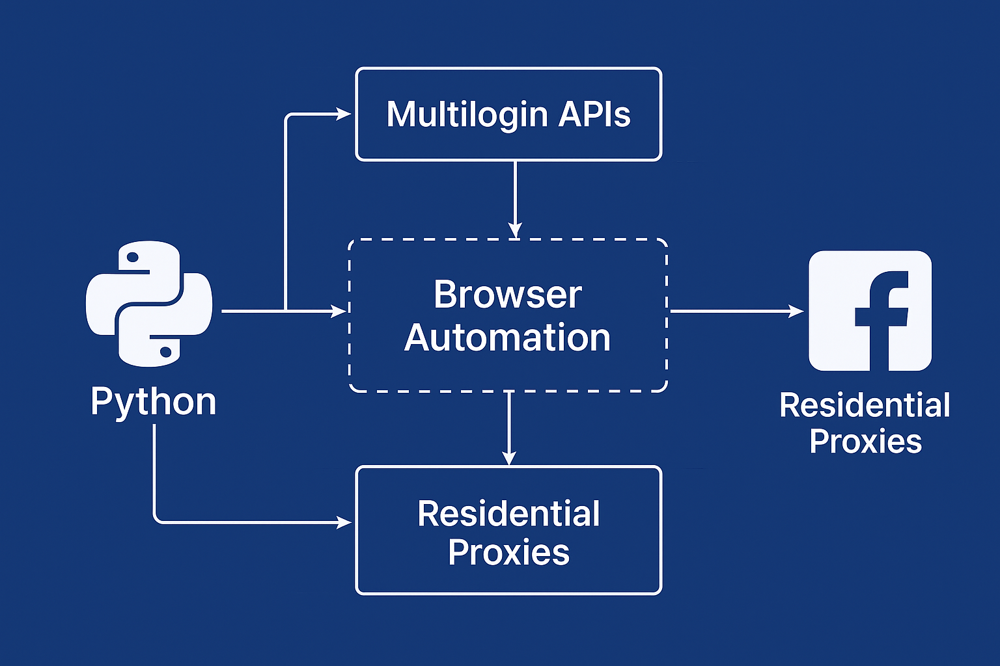
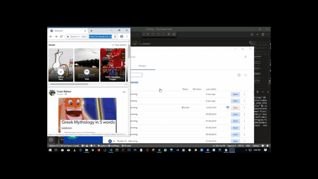
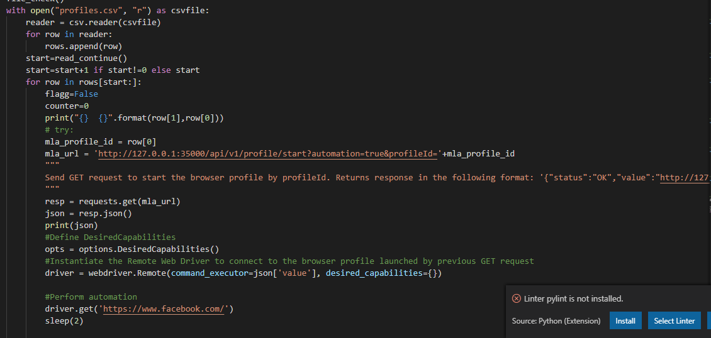

# Facebook Automation Bot (Multilogin + Residential Proxies)

  
  
  
  

<h2 align="center">Contact</h2>

  
  

> Automate **human-like Facebook activity at scale** using Multilogin profiles + residential proxies.
> Features include randomized browsing, ad discovery, stories/videos interaction, and robust per-profile tracking.

  

##  Overview
This project is a **Facebook Automation Bot** powered by **Python, Selenium, Multilogin APIs, and Residential Proxies**.
It simulates **human-like behavior**—scrolling feeds, watching stories, liking, commenting, and engaging with content—while managing multiple profiles safely through Multilogin.
The system is built for **scalability, randomization, and reliability**, making it suitable for research, testing, and internal automation workflows.

---
##  Features
- **Dynamic scrolling** with realistic scroll physics
- **Randomized delays** & human-like action jitter
- **Watch stories & videos** with adjustable dwell times
- **Click random posts** & **sponsored ads** (opens in new window)
- **Check profiles & read comments** like a real user
- **Like & comment posts** with customizable templates
- **Per-profile randomization** for unique patterns
- **Exception handling** for checkpoints & blocked accounts
- **Profile tracking**: logs, state, and reports 
## **Planned (To-Do):**
- Friend requests
- Sending messages
- Notification checking
- Uploading posts
- Multi-threaded profile automation
---
##  Tech Stack
- **Python 3.10+** – core logic
- **Selenium** – browser automation
- **Multilogin Local API** – profile management
- **Residential Proxies** (Bright Data / Luminati / others)
- **Requests** + **BeautifulSoup** – supporting parsers & HTTP calls
---
## Architecture

  

##  Demo

  

  

---
##  Roadmap
- [ ] Friend requests & messaging
- [ ] Notification watcher
- [ ] Post uploader
- [ ] Multiprocessing worker pool
- [ ] Web dashboard with metrics
---
## ​ Contact

- Discord Server [Appilot Community](https://discord.gg/zX7frTbx)
- Telegram: [@devpilot1](https://t.me/devpilot1)

  

